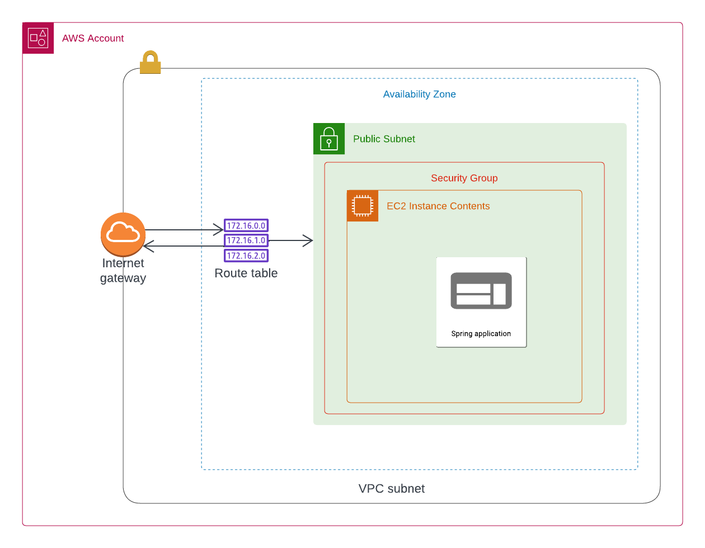

### Project description
deploying Java spring boot application to production using Jenkins as CI/CD, Terraform as IAC, and Docker to build container and push to docker hub

### Jenkinsfile breakdown:
- environment 
```diff 
    environment {
        USER_CREDENTIALS = credentials('docker_account') # Docker credentials 
        DOCKER_IMAGE = "sherifemad21/school-backend:v-${BUILD_ID}" # Docker image to be built and pushed
        DOCKER_USERNAME = "${USER_CREDENTIALS_USR}"
        DOCKER_PASSWORD = "${USER_CREDENTIALS_PSW}"

        AWS_CREDENTIALS = credentials('aws_credentials') # AWS Access key 
        ACCESS_KEY = "${AWS_CREDENTIALS_USR}"
        SECRET_KEY = "${AWS_CREDENTIALS_PSW}"

    }
```
- Stage(1) Test the maven project
```diff 

        stage('Maven test') {
            agent {
                docker { 
                    image 'openjdk:latest'
                }
            }

            steps {
                dir("./app") {
                    sh "chmod +x mvnw"
                    sh "./mvnw test"
                }
            }
        }

```
- Stage(2) Build the maven project
```diff 
        stage('Maven build') {
            agent {
                docker {
                    image 'openjdk:latest'
                }
            }

            steps {
                dir("./app") {
                    sh "chmod +x mvnw"
                    sh "./mvnw clean"
                    sh "./mvnw install"
                }
            }
        }
```
- Stage(3) Login to dockerhub using docker credentials
```diff
        stage('Docker Credentials') {
            steps {
                sh 'docker logout'
                sh "echo ${DOCKER_USERNAME}"
                sh "echo ${DOCKER_PASSWORD}"
                sh "docker login -u ${DOCKER_USERNAME} -p ${DOCKER_PASSWORD}"
            }
        }           

```

- Stage (4) build application docker image
```diff 
        stage('Docker Build') {
            steps {
                dir("./app") {
                    sh "docker build -t ${DOCKER_IMAGE} ."
                }
            }
        }
-- Docker file ------------------------------------
    FROM openjdk:latest

    #To add the runnable jar file of the backend project to the container
    ADD ./target/school-backend-docker.jar school-backend-docker.jar

    #To specify the command that runs the jar files in the /bin/bash in the container
    ENTRYPOINT ["java" ,"-jar", "/school-backend-docker.jar"]
-- ---------------------------------------------------     

```
- Stage (5) push the docker image to the dockerhub
``` diff 
        stage('Docker Push') {
            steps {
                sh "docker push ${DOCKER_IMAGE}"
                sh "docker rmi -f ${DOCKER_IMAGE}"
            }
        }
```
- Stage (6) Edit templates to pass the docker credentials and aws key to docker run script and terraform variables
```diff 
        stage('Edit files') {
            steps {
                dir("./terraform") {
                    sh """
                      sed -e "s|DockerImageToPull|${DOCKER_IMAGE}|g" -e "s|Username|${DOCKER_USERNAME}|g" -e "s|Password|${DOCKER_PASSWORD}|g" dockerScript-template.sh > dockerScript.sh                    
                    """

                    sh """
                      sed -e "s|ACCESS_KEY_TO_REPLACE|${ACCESS_KEY}|g" -e "s|SECRET_KEY_TO_REPLACE|${SECRET_KEY}|g" terraform-template.txt > terraform.tfvars   

                    """
                }
            }
        }

```
- Stage (7) deploy IAC using terraform to an AWS EC2 instance
```diff 
        stage("Deploy to AWS IAC") {
            when {
                branch 'master'
            }

            steps {
                dir("./terraform") {
                    sh 'terraform init'
                    sh "terraform plan"
                    sh 'terraform destroy --auto-approve'
                    sh 'terraform apply --auto-approve'
                }
            }

            post {
                success {
                    echo "Successfully deployed to AWS"
                }

                failure {
                    dir("./terraform") {
                    sh 'terraform destroy --auto-approve'
                    }
                }   
            }
        }
```
-  Stage (8) Somke test on the deployment to check if everything is running
```diff 
        stage("Smoke test on deployment") {
            when {
                branch 'master'
            }

            steps {
                dir("./terraform") {
                    sh 'chmod +x smokeTest.sh'
                    sh "./smokeTest.sh"
                }
            }

            post {
                success {
                    echo "Smoke test successful"
                }

                failure {
                    echo "Public IP not available yet. Please wait and try again later."
                }
                
            }
        }
-- Smoke test script ------------------------------------
#! /bin/bash

echo "Waiting for application to run..."

sleep 120

# Get the public IP of the AWS EC2 instance
public_ip=$(terraform output -raw server_ip)

echo "Public IP of the EC2 instance: $public_ip"

# Curl to the public IP
while true; do
    curl_result=$(curl "http://$public_ip:8080/api/course/getCourses") && break  # Break the loop on successful connection
    sleep 120
done


# Display the result
echo "Curl Result:"
echo "$curl_result"
-- ---------------------------------------------------     
```

### Terraform main.tf breakdown:
### Provider
- define the cloud provider which provision the desired resources

```diff 
provider "aws" {
    region = "eu-west-3"
    access_key = var.access_key
    secret_key = var.secret_key
}
```

### Variables
```diff 
variable vpc_cider_block {}

variable subnet_cider_block {}

variable avail_zones {}

variable env_prefix {}

variable my_ip {}

variable instance_image {}

variable instance_type {}

variable key_name {}

variable access_key {}

variable secret_key {}

-- terraform.tfvats ------------------------------------
vpc_cider_block = "10.0.0.0/16" # local network between all subnets inside vpc

subnet_cider_block = "10.0.0.0/24" # allow global access

avail_zones = "eu-west-3b" # availibality zones for deployment

env_prefix = ["dev", "prod"] # VPC environments

my_ip = "156.208.134.24/32"

instance_image = "ami-05b5a865c3579bbc4"

instance_type = "t2.micro"

key_name = "connection"

access_key = ""

secret_key = ""
-- ---------------------------------------------------     
```
### Virtual private cloud (VPC)
- An isolated network from other vpcs to ensure security
```diff 
resource "aws_vpc" "myapp-vpc" {
  cidr_block = var.vpc_cider_block
  tags = {
    Name = "${var.env_prefix[0]}-vpc"
  }
}
```
### Internet gateway
- Internet gateways are responsible for exposing the application to the global internet
```diff 
resource "aws_vpc" "myapp-vpc" {
  cidr_block = var.vpc_cider_block
  tags = {
    Name = "${var.env_prefix[0]}-vpc"
  }
}
```
### Route table
- Route tables are responsible for routing requests from the internet gateway to the desired subnet
```diff 
resource "aws_route_table" "private_route_table" {
    vpc_id = aws_vpc.myapp-vpc.id

    route {
        cidr_block = "0.0.0.0/0"
        gateway_id = aws_internet_gateway.igw.id
    }

    tags = {
        Name: "${var.env_prefix[0]}-rtb"
    }
}
```
### Subnet
- subnets are parts of the vpc with a range of ips and acts as the container for the ec2 instance
```diff 
resource "aws_subnet" "subnet-1" {
  vpc_id            = aws_vpc.myapp-vpc.id
  cidr_block        = var.subnet_cider_block
  availability_zone = var.avail_zones

  tags = {
    Name = "${var.env_prefix[0]}-subnet"
  }
}
```
### Route table association
- define an association between route tables and subnets
```diff 
resource "aws_route_table_association" "rtb-association" {
    subnet_id = aws_subnet.subnet-1.id 
    route_table_id = aws_route_table.private_route_table.id
}
```
### EC2 instance
- EC2 is the virtual machine instance provided by AWS which are used as the servers to host applications
```diff 
resource "aws_instance" "my-app-server" {
    ami               = var.instance_image
    instance_type     = var.instance_type
    
    availability_zone = var.avail_zones
    key_name          = var.key_name
    subnet_id = aws_subnet.subnet-1.id
    vpc_security_group_ids = [ aws_security_group.myapp-sg.id]

    associate_public_ip_address = true
    
    #  bash script for automating deploying process
    user_data =  "${file("dockerScript.sh")}" 


    tags = {
        Name = "${var.env_prefix[0]}-app"
    }
}
```
### Security group
- Security groups can be looked at as a firewall to the ec2 instance as it controls the connections and exposes the ports to be used publicly and blocks all request that are not defined within the group
```diff 
resource "aws_security_group" "myapp-sg" {
    name = "myapp-sg"
    vpc_id = aws_vpc.myapp-vpc.id
    
    # ingress --> inbound filter
    ingress {
        description = "SSH"
        from_port   = 22
        to_port     = 22
        protocol    = "tcp"
        cidr_blocks = [var.my_ip]
    }

    ingress {
        description = "HTTP"
        from_port   = 8080
        to_port     = 8080
        protocol    = "tcp"
        cidr_blocks = ["0.0.0.0/0"]
    }

    # egress --> outbound filter
    egress {
        from_port   = 0
        to_port     = 0
        protocol    = "-1"
        cidr_blocks = ["0.0.0.0/0"]
        prefix_list_ids = []
    }

    tags = {
        Name = "${var.env_prefix[0]}-sg"
    }
}
```

### Outputs
```diff 
output "server_ip" {
  value = aws_instance.my-app-server.public_ip
}
```
### Overview diagram of the deployment

 